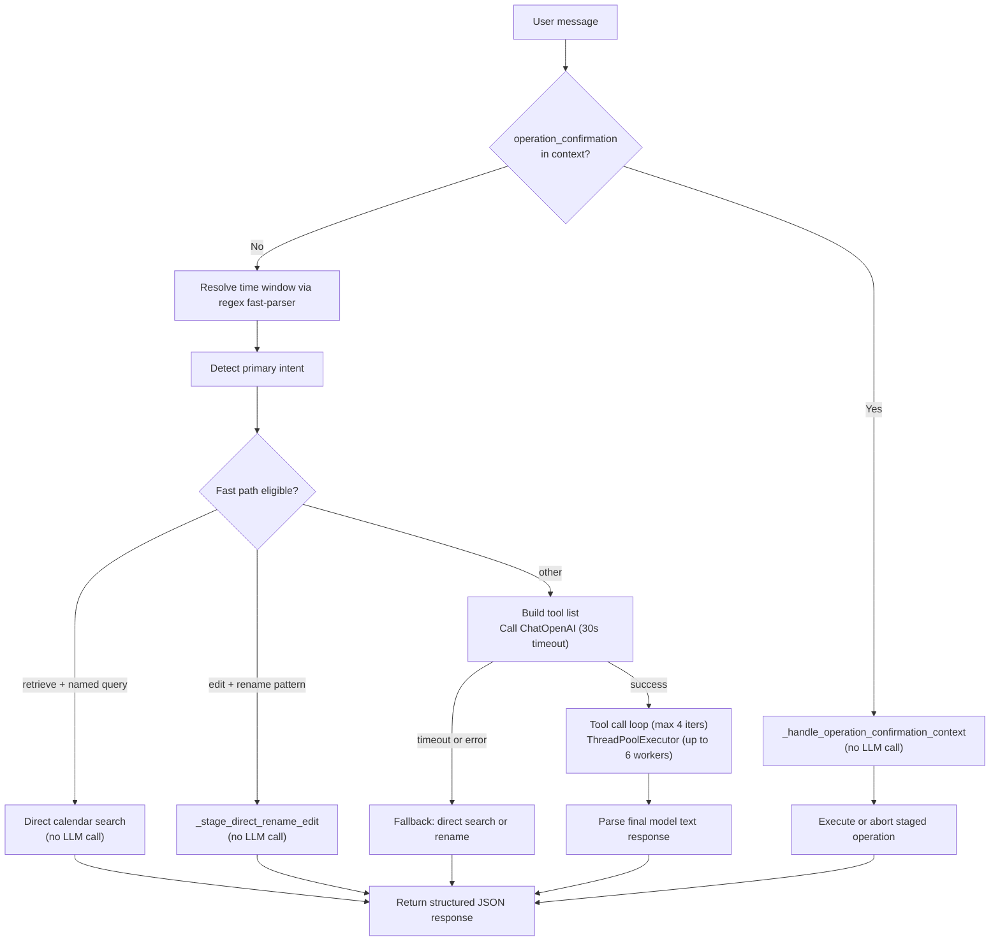

# PersonalAgent — Operations and Architecture

This document is the authoritative reference for how PersonalAgent is structured, how to run it, and how its components interact.

---

## 1. Stack Snapshot

| Layer | Technology | Key Files |
|---|---|---|
| Backend runtime | FastAPI + Uvicorn | `app/main.py` |
| Agent orchestration | LangChain + OpenAI GPT | `app/agent/core.py` |
| Calendar integration | Google Calendar API v3 + OAuth 2.0 | `app/google/auth.py`, `app/google/calendar_service.py` |
| Document ingestion | Upload registry + typed extractors + AI planner | `app/uploads/service.py`, `app/uploads/extractors.py`, `app/uploads/planner.py` |
| External data sources | ESPN (unofficial), MLB Stats API, Jolpica-F1 | `app/data_sources/sports.py`, `app/data_sources/router.py` |
| Frontend | React + TypeScript + Vite | `frontend/src/` |
| Desktop shell | Tauri (Rust-based system webview) | `frontend/src-tauri/` |
| Automated testing | Pytest + Vitest + React Testing Library + GitHub Actions | `tests/`, `frontend/src/**/*.test.tsx`, `.github/workflows/` |
| Configuration | Pydantic Settings + `.env` | `app/config.py` |

**Tauri app details:**
- Product name: `PersonalAgent`
- App identifier: `com.personalagent.desktop`
- Window: 1440×920 px, minimum 1120×760 px, resizable
- Installers produced: MSI and NSIS

**Runtime auth files (git-ignored, placed manually):**
- `data/google_client_secret.json` — Google OAuth 2.0 client credentials
- `data/google_token.json` — Stored access/refresh tokens (auto-generated after first auth)

---

## 2. Startup and Shutdown (PowerShell)

### Starting the backend

```powershell
# from project root
.\.venv\Scripts\Activate.ps1
pip install -r requirements.txt
pip install -r requirements-dev.txt
uvicorn app.main:app --reload
```

Backend URL: `http://127.0.0.1:8000`

Useful checks:

```powershell
Invoke-RestMethod http://127.0.0.1:8000/health
Invoke-RestMethod http://127.0.0.1:8000/auth/google/status
```

### Starting the frontend (dev mode)

```powershell
cd frontend
npm install
npm run dev
```

Frontend URL: `http://localhost:5173`

### Building the desktop installer

```powershell
cd frontend
npm run tauri:build
```

Output path: `frontend\src-tauri\target\release\bundle\`

### Stopping processes

In each terminal, press `Ctrl + C`. If prompted `Terminate batch job (Y/N)?`, press `Y`. Then optionally deactivate the venv:

```powershell
deactivate
```

### Killing a stuck process

```powershell
# find process using backend port
netstat -ano | Select-String ":8000"

# find process using frontend port
netstat -ano | Select-String ":5173"

# kill by PID
taskkill /PID <PID> /F
```

---

## 3. API Layer (`app/main.py`)

### Endpoints

| Method | Path | Purpose |
|---|---|---|
| `GET` | `/health` | Liveness probe → `{"status": "ok"}` |
| `GET` | `/config/test-openai` | Pings OpenAI to verify the API key |
| `GET` | `/auth/google/status` | Returns `{"authorized": bool, "reason"?: str}` |
| `GET` | `/auth/google/start` | Triggers blocking OAuth2 InstalledAppFlow, writes token |
| `GET` | `/calendar/events` | Lists upcoming events (raw Google Calendar, not agent) |
| `POST` | `/calendar/events` | Creates or updates a single event (raw, not agent) |
| `POST` | `/agent/chat` | Main natural-language entrypoint; body: `{message, context}` |
| `POST` | `/agent/uploads` | Uploads a document and returns `upload_id` with status |
| `GET` | `/agent/uploads/{upload_id}` | Returns upload metadata/status and stored analysis (if any) |
| `POST` | `/agent/uploads/{upload_id}/analyze` | Extracts document text, plans operation candidates, and stages confirmation |

### CORS

Allowed origins:
- `http://localhost:5173` (Vite dev server)
- `http://127.0.0.1:5173`
- `tauri://localhost` and `https://tauri.localhost` (Tauri webview)
- `http://127.0.0.1` (all ports, for direct backend access)

### Auth error serialization

Any `ServiceAuthRequiredError` raised during calendar operations is caught at the endpoint level and returned as a structured `401 Unauthorized` JSON response:

```json
{
  "error": "service_auth_required",
  "service": "google_calendar",
  "service_display_name": "Google Calendar",
  "reauth_endpoint": "/auth/google/start",
  "message": "Google Calendar authorization has expired or was revoked."
}
```

---

## 4. Agent Orchestration (`app/agent/core.py`)

This is the core of the application (~2800 lines). It defines all LangChain tools, manages the agent loop, and handles confirmation flows.

### Tools

| Tool | Description |
|---|---|
| `get_upcoming_events(max_results)` | Fetches up to 200 upcoming events from the primary calendar |
| `search_calendar_events(query, start_time, end_time, weekday, count, allow_past)` | Filtered calendar search with past-event guard |
| `create_event(summary, start, end, timezone, description, event_options)` | Stages one event candidate; does not write to calendar yet |
| `batch_create_events(events: list)` | Stages many candidates in a single tool call |
| `search_official_sources(subject, start_time, end_time, timezone)` | Calls ESPN/MLB/F1 APIs; returns `not_covered` if unrecognized |
| `search_web_for_events(subject, ...)` | GPT-powered web search for real-world schedules |
| `delete_calendar_events(event_ids, query, start_time, end_time, ...)` | Resolves candidate events for deletion, stages for confirmation |
| `edit_calendar_events(event_ids, query, ..., summary, start, end, ...)` | Resolves candidate events for edit, stages for confirmation |

### `run_agent_chat()` flow



### Key helpers

| Function | Purpose |
|---|---|
| `_resolve_time_window(message, now_local)` | Pure regex NLP; converts phrases like "this weekend", "next 3 weeks", "Q2 2027" into `{start_iso, end_iso, timezone, source_phrase}` without calling the LLM |
| `_detect_primary_intent(message)` | Classifies message as `add | delete | edit | retrieve | unknown` via regex |
| `_extract_named_event_query(message)` | Extracts a compact title from "events named X" patterns for the retrieve fast-path |
| `_extract_bulk_rename_request(message)` | Detects "rename X to Y" patterns for the edit fast-path |
| `_extract_general_search_term(message, resolved_time_window)` | Extracts a generic search term for deterministic retrieve fast-path |
| `_extract_delete_query(message, resolved_time_window)` | Extracts delete subject for deterministic delete fast-path and suppresses time/date-only prompts from becoming bad title queries |
| `_clean_tool_args(tool_name, raw_args, ...)` | Sanitizes and normalizes every argument for every tool before dispatch |
| `_sanitize_event_overrides(raw_value)` | Allowlist-based sanitizer for Google Calendar fields (`reminders`, `recurrence`, `attendees`, `colorId`, etc.) |
| `_build_reauth_required_response(...)` | Factory for the `reauthorization_required` response, including `resume_context` for frontend replay |
| `_handle_operation_confirmation_context(context, runtime_context)` | Short-circuits the LLM when the incoming message is a confirmation or cancel |
| `stage_document_candidates_for_confirmation(upload_id, filename, analysis)` | Converts upload analysis output into confirmation candidates and stores pending state |

### Pending confirmations

`PENDING_CONFIRMATIONS` is an in-memory dict keyed by UUID. It holds staged operation data (candidates, update fields, operation type) between the `*_pending_confirmation` response and the user's confirm or cancel reply.

### Response shape

Every response from `/agent/chat` is a JSON object with:

```json
{
  "result_type": "calendar_events",
  "action": "<AgentAction>",
  "summary": {},
  "events": [],
  "meta": {},
  "tool_results": []
}
```

`action` is one of: `create`, `add_pending_confirmation`, `add_cancelled`, `edit`, `edit_pending_confirmation`, `edit_cancelled`, `delete`, `delete_pending_confirmation`, `delete_cancelled`, `document_pending_confirmation`, `document_cancelled`, `retrieve`, `reauthorization_required`, `mixed`, `none`.

---

## 4.1 Document Upload Pipeline (`app/uploads/`, `app/main.py`)

Document upload flow is AI-assisted and confirmation-gated:

1. `POST /agent/uploads` accepts `txt`/`docx`/`pdf`/`xlsx`/`ics`/`png`/`jpg`/`jpeg`, validates file size/type, and stores the file in `data/uploads/` with in-memory metadata.
2. `POST /agent/uploads/{upload_id}/analyze` requires a `message` instruction and optional `timezone`.
3. `extract_content_from_file(...)` returns typed extracted content:
   - text content (`txt`, `docx`, `pdf`, `xlsx`)
   - image content base64 + MIME (`png`, `jpg`, `jpeg`)
   - deterministic ICS event list (`ics`)
4. `plan_document_operations(...)` routes extraction:
   - GPT-4o JSON-schema extraction for text/image documents
   - deterministic mapping for ICS events
5. Planned candidates are staged through `stage_document_candidates_for_confirmation(...)`, which writes to `PENDING_CONFIRMATIONS`.
6. User confirms/cancels through existing `operation_confirmation` flow in `/agent/chat`.
7. On confirm, operations are applied using existing calendar mutation APIs (`create_or_update_event`, `update_events_by_id`, `delete_events`).

Document candidate metadata includes:
- `operation`
- `candidate_type`
- `source_document_id`
- `source_excerpt`
- `confidence`
- `parse_warnings`

---

## 5. Calendar Service (`app/google/calendar_service.py`)

Responsibilities:

- Event retrieval: `list_upcoming_events`, `search_events`
- Event normalization for the frontend: `normalize_event`, `normalize_events`
- Candidate resolution for safe deletes: `resolve_delete_candidates`
- Deletion: `delete_events`, `delete_event_by_id`
- Create and update: `create_or_update_event`

Search supports filtering by text query, time range, weekday, and repeating weekday count. Future-only results are the default unless `allow_past=True` is explicitly passed.

Every function in this module calls `get_calendar_credentials()` from `app/google/auth.py`. If credentials are missing or revoked, a `ServiceAuthRequiredError` is raised and propagates up to the agent or API layer.

---

## 6. Auth Layer (`app/google/auth.py`)

### `ServiceAuthRequiredError`

A custom `RuntimeError` subclass that carries structured authorization failure details:

| Field | Value |
|---|---|
| `service` | `"google_calendar"` |
| `service_display_name` | `"Google Calendar"` |
| `reauth_endpoint` | `"/auth/google/start"` |
| `reason` | `"token_revoked_or_expired"` or `"missing_refresh_token"` |

This exception is the single shared error class for Google OAuth failures. It propagates from the calendar service layer through the agent and up to the API response, ensuring the frontend always receives a structured signal rather than a generic error or empty result.

### `get_calendar_credentials()`

Loads tokens from `data/google_token.json`. If the access token is expired, attempts a silent refresh using `google-auth`. On `invalid_grant` (revoked or expired refresh token) or missing refresh token, raises `ServiceAuthRequiredError` immediately. On success, returns a valid `google.oauth2.credentials.Credentials` object.

### `start_google_auth_flow()`

Runs `InstalledAppFlow.run_local_server(port=0, prompt="consent")`. This is a blocking call that opens a browser tab for OAuth consent and saves the resulting tokens to `data/google_token.json`. Called by the `/auth/google/start` endpoint and triggered from the frontend's re-authorization panel.

---

## 7. Sports Data Sources (`app/data_sources/`)

### Providers

| Provider | Base URL | Coverage |
|---|---|---|
| ESPN (unofficial, no key) | `site.api.espn.com/apis/site/v2/sports` | MLB, NFL, NBA, NHL, MLS, WNBA, UFC, PGA, college sports |
| MLB Stats API (official, no key) | `statsapi.mlb.com/api/v1` | MLB schedules (fallback when ESPN unavailable) |
| Jolpica-F1 (free, no key) | `api.jolpi.ca/ergast/f1` | Formula 1 race calendar |

### Resolution flow

`search_sports_events(subject, start_time, end_time, timezone_str)` is the public entry point. It parses the `subject` string to identify the league and team via fuzzy matching against a dynamically fetched ESPN teams list (cached for 24 hours), then routes to the appropriate provider. Results are cached for 300 seconds in `_SPORTS_RESULT_CACHE` keyed on `(subject, start_time, end_time, timezone)`.

### Extensibility

`app/data_sources/router.py` is a thin domain router. `try_official_source()` calls `search_sports_events()` and returns `None` if no match is found. Adding a new domain (music, movies, concerts) means registering a new connector in `router.py` without touching the agent.

---

## 8. Two-Phase Write Safety Design

All write operations (add, edit, delete) follow the same two-step pattern:

**Step 1 — Stage:**

The tool (`batch_create_events`, `edit_calendar_events`, `delete_calendar_events`) resolves candidate events and returns a `*_pending_confirmation` response. No calendar writes occur. The operation details are stored in `PENDING_CONFIRMATIONS` under a UUID key.

```json
{
  "action": "delete_pending_confirmation",
  "summary": {
    "requires_confirmation": true,
    "candidates": [...],
    "candidate_count": 3,
    "confirmation_id": "<uuid>"
  }
}
```

**Step 2 — Confirm or cancel:**

The frontend sends the user's decision back as a context field:

```json
{
  "context": {
    "operation_confirmation": {
      "action": "confirm",
      "selected_ids": ["<event_id_1>", "<event_id_2>"]
    }
  }
}
```

`_handle_operation_confirmation_context()` intercepts this before any LLM call, executes or aborts the staged operation, and returns the final result.

This design ensures no event is ever created, edited, or deleted without explicit user confirmation. The LLM is never involved in the execution step.

---

## 9. Service Re-Authorization Recovery

When Google Calendar authorization is lost (token revoked, expired, or missing), the backend returns a structured interruption response instead of an empty result or a generic error.

### Backend response

```json
{
  "result_type": "calendar_events",
  "action": "reauthorization_required",
  "summary": {
    "error_code": "service_auth_required",
    "service": "google_calendar",
    "service_display_name": "Google Calendar",
    "reauth_endpoint": "/auth/google/start",
    "requires_reauth": true,
    "resume_supported": true,
    "resume_context": {
      "message": "<original user message>",
      "context": {}
    }
  }
}
```

The `resume_context` contains the original request payload so the frontend can replay it after re-authorization completes.

### Frontend recovery flow

1. `App.tsx` detects `action === "reauthorization_required"` and stores the original request in `lastRequestRef`.
2. `ServiceReauthPanel` renders with the service name and a prompt asking the user to re-authorize or decline.
3. If the user accepts, `reauthorizeAndResume()` calls `startGoogleReauthorization()` (which hits `/auth/google/start`), then polls `getGoogleAuthStatus()` until authorization is confirmed.
4. On success, the original request from `lastRequestRef` is replayed automatically, continuing the interrupted operation.
5. If the user declines, `declineReauthorization()` clears the reauth state and ends the flow.

---

## 10. Frontend Architecture (`frontend/src/`)

### Component tree

```
App
├── InputPanel            — text input, public-event toggle, submit and cancel buttons
├── DocumentUploadPanel   — file picker + upload/analyze action
├── DocumentAnalysisPanel — upload analysis counts/warnings
├── StatusTimeline        — animated phase label and loading indicator
├── [error panel]         — inline error display
├── ServiceReauthPanel    — shown when action == 'reauthorization_required'
├── ConfirmationPanel     — shown for *_pending_confirmation actions; checkbox selection
├── EventsTable           — renders result.events as a table
└── AdminDebugPanel       — collapsible bottom-right panel; ActionSummaryCard + TechnicalDetails
```

### `api.ts` — Backend communication

| Export | Description |
|---|---|
| `API_BASE_URL` | Reads `VITE_API_BASE_URL`, defaults to `http://127.0.0.1:8000` |
| `DEFAULT_TIMEOUT_MS` | `60_000` ms — standard request timeout |
| `AUTH_FLOW_TIMEOUT_MS` | `300_000` ms — 5 minutes, for the blocking OAuth flow |
| `MAX_RETRIES` | `1` — retries on 408/429/5xx with 400 ms backoff |
| `sendAgentMessage(message, context?, options?)` | POSTs to `/agent/chat`; supports abort signal, timeout, retry, attempt callback |
| `uploadDocument(file)` | POSTs multipart file to `/agent/uploads` and returns `upload_id` |
| `getUploadStatus(uploadId)` | GETs `/agent/uploads/{upload_id}` |
| `analyzeUploadedDocument(uploadId, options)` | POSTs to `/agent/uploads/{upload_id}/analyze` with required `message` and returns staged confirmation response |
| `getGoogleAuthStatus()` | GETs `/auth/google/status` → `{authorized, reason?}` |
| `startGoogleReauthorization(timeoutMs?)` | GETs `/auth/google/start` with 5-minute timeout |

### `contracts/agentContract.ts` — Request/response contract

**`buildAgentRequest(message, context?)`** — Constructs `{message, context: {...context, contract_version: 'v1', client_platform: 'desktop'}}`. Every request is stamped with the contract version and platform to support future mobile parity.

**`buildUploadAnalyzeRequest(uploadId, message, timezone?, context?)`** — Constructs upload-analysis payload with required message instruction and contract metadata in `context`.

**`parseAgentResponse(value)`** — Runtime validator. Throws if `result_type !== 'calendar_events'`, `action` is missing, `events` is not an array, or `tool_results` is not an array.

**`parseUploadResponse(value)`** — Runtime validator for upload endpoint payloads (`upload_id`, `status`).

### `AgentAction` union type

```
'create' | 'add_pending_confirmation' | 'add_cancelled' |
'edit' | 'edit_pending_confirmation' | 'edit_cancelled' |
'document_pending_confirmation' | 'document_cancelled' |
'delete' | 'delete_pending_confirmation' | 'delete_cancelled' |
'retrieve' | 'reauthorization_required' | 'mixed' | 'none'
```

### QA scripts

| Script | Command | Purpose |
|---|---|---|
| `npm run test` | `vitest run` | Runs frontend unit/component tests |
| `npm run test:watch` | `vitest` | Runs frontend tests in watch mode for local development |
| `npm run contract:check` | `node ./scripts/validate-contract-fixtures.mjs` | Validates all JSON fixtures against the contract schema |
| `npm run prompt:validate` | `node ./scripts/run-prompt-validation.mjs` | Runs prompt regression suite against a live backend |
| `npm run qa:desktop` | `lint + contract:check + build` | Full pre-release gate |

---

## 11. Test Suite and CI

### Backend tests (Pytest)

- Config: `pytest.ini` (`asyncio_mode = auto`, `testpaths = tests`)
- Coverage focus:
  - `tests/api/` — endpoint-level behavior using FastAPI `TestClient`
  - `tests/unit/` — upload validation/extractors, data-source router behavior, sports connector error/fallback paths, and agent helper logic
  - `tests/contracts/` — Python contract validation of checked-in frontend fixture payloads
- Run command:

```powershell
.\.venv\Scripts\Activate.ps1
pytest -m "not integration"
```

### Frontend tests (Vitest + React Testing Library)

- Config: `frontend/vitest.config.ts` + `frontend/src/test/setupTests.ts`
- Current focus: contract parser/builders and key UI state components
- Run command:

```powershell
cd frontend
npm run test
```

### CI Workflows

- `/.github/workflows/ci.yml`
  - Trigger: push + pull request
  - Runs backend tests (`pytest -m "not integration"`), frontend tests (`npm run test`), and release gates (`npm run qa:desktop`)
- `/.github/workflows/nightly-prompt-validation.yml`
  - Trigger: nightly schedule + manual dispatch
  - Starts backend with `OPENAI_API_KEY` secret, runs `npm run prompt:validate`, uploads report artifacts

---

## 12. Contract Fixtures (`frontend/src/contracts/fixtures/`)

These JSON snapshots are checked in CI by `npm run contract:check` to prevent accidental breaking changes to the API shape.

| Fixture | Purpose |
|---|---|
| `agent-request.desktop.v1.json` | Sample desktop request with `contract_version: v1`, `client_platform: desktop` |
| `agent-request.mobile.v1.json` | Same message with `client_platform: mobile` — parity-checked against desktop |
| `agent-response.v1.json` | Baseline retrieve response |
| `agent-response.create.v1.json` | Successful event creation response |
| `agent-response.reauth-required.v1.json` | `action: reauthorization_required`, `requires_reauth: true` |
| `agent-response.reauth-declined.v1.json` | User declined re-authorization path |
| `agent-response.reauth-resumed-success.v1.json` | Re-auth completed and original request replayed successfully |
| `agent-upload-request.desktop.v1.json` | Upload-analysis request contract fixture for desktop |
| `agent-upload-analysis-response.v1.json` | Upload analysis staged response fixture (`document_pending_confirmation`) |
| `agent-upload-confirmation-pending.v1.json` | Pending confirmation fixture for document-derived candidates |
| `agent-upload-confirmed-success.v1.json` | Successful confirm/apply fixture for document operations |
| `agent-upload-error-unsupported-type.v1.json` | Upload error fixture for unsupported file types |
| `prompt-validation.v1.json` | Input/output pairs for LLM prompt regression tests |

---

## 13. Implemented Features

All of the following are fully implemented and operational.

**Performance:**
- Parallel tool execution via `ThreadPoolExecutor` (up to 6 workers per LLM turn)
- Async LLM invocation (`model.ainvoke()`) to avoid blocking the event loop
- Official source result caching (5-minute TTL, keyed on subject + time range + timezone)
- Team name caching (24-hour TTL for ESPN team lookups)
- 30-second LLM call timeout with deterministic fallback paths

**Deterministic fast-paths (no LLM):**
- Named query retrieval: "show all events named X for this year" resolved via regex + direct calendar search
- Bulk rename: "rename all X events to Y" resolved via regex + direct calendar search + staged edit
- Generic time-window retrieval and delete-by-query routing through direct calendar tooling
- Confirmation handling: confirm/cancel processed directly without any LLM call

**Time window resolution:**
- Pure regex NLP parser converts natural-language phrases to ISO date ranges without calling the LLM
- Covers: `today`, `tomorrow`, `yesterday`, `this week`, `next week`, `last week`, `this month`, `next month`, `this year`, `next N days/weeks/months`, `Q1–Q4`, specific months, `this morning`, `this afternoon`, `this evening`, seasons, and more
- Future-oriented by default for relative phrases; past-oriented when the user explicitly asks for past events

**Write safety:**
- Two-phase add/edit/delete: stage → user confirmation → execute
- Confirmation-gated writes stored in `PENDING_CONFIRMATIONS` keyed by UUID
- Edit supports partial updates (`events.patch()`), series-aware scope (`selected` instance vs. `series` master), and multi-strategy fuzzy matching
- Document upload operations are AI-extracted/staged and confirmed through the same `PENDING_CONFIRMATIONS` safety path
- Delete query extraction avoids converting time/date-only requests (for example `3pm est`) into brittle title queries, improving candidate resolution for time-window deletes

**External data sources:**
- ESPN (MLB, NFL, NBA, NHL, MLS, WNBA, UFC, PGA, college sports)
- MLB Stats API (official MLB fallback)
- Jolpica-F1 (Formula 1 race calendar)
- Fuzzy team name matching against dynamically fetched team lists
- Extensible router for future connectors (music, movies, etc.)

**Google auth:**
- Silent token refresh on expiry
- Structured `ServiceAuthRequiredError` for revoked/expired tokens
- Full re-authorization recovery flow from within the UI, with automatic replay of the interrupted request

**API contract:**
- Versioned request/response contract (`v1`)
- Platform-stamped requests (`desktop`, future: `mobile`) for parity
- Runtime response validation on the frontend
- JSON contract fixtures with CI validation
- Prompt regression test harness with report output
- Optional upload probe in prompt validation harness using `PROMPT_VALIDATION_UPLOAD_FILE_PATH`

**Desktop packaging:**
- Tauri shell wrapping the React frontend as a native window
- MSI and NSIS installers produced by `npm run tauri:build`
- CSP allows connections to `https:` and `http://127.0.0.1:*`
